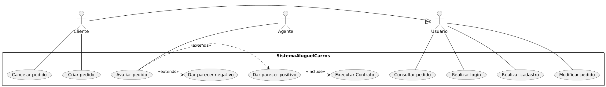
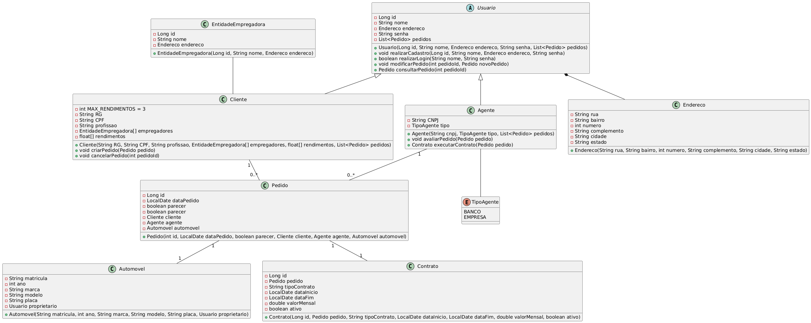
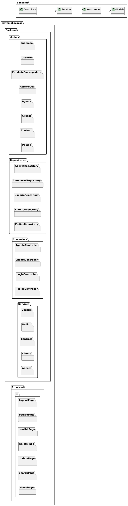
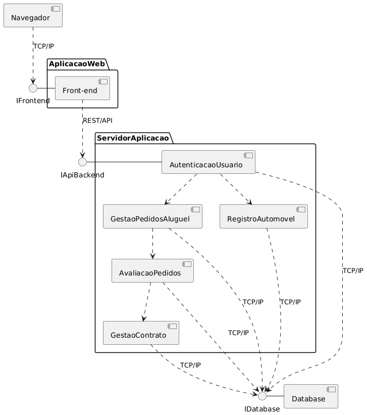
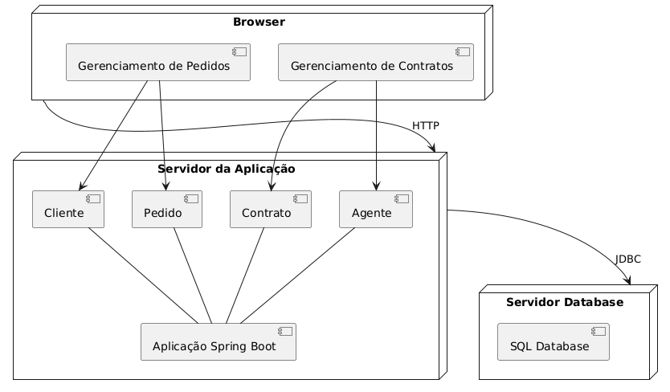

## LabDesenvDeSoftware
Repositório da matéria de Laboratório de Desenvolvimento de Software da do curso de Engenharia de Software da PUC Minas. Acesse:

- [Laboratório 1 - Sistema de Matrículas](https://github.com/juliavianna/LabDesenvDeSoftware/tree/main/laboratorio1)
- [Laboratório 2 - Sistema de Aluguel de Carros](https://github.com/juliavianna/LabDesenvDeSoftware/tree/main/laboratorio2)
- Laboratório 3 (em breve)
- Laboratório 4 (em breve)
- Laboratório 5 (em breve)

A seguir, são apresentados os artefatos do laboratório atual (Laboratório 2).

# Diagrama de caso de uso

# Diagrama de classes

# Diagrama de pacotes

# Diagrama de componentes

# Diagrama de implantação

# Histórias de Usuário

### Usuário (comum a todos)

Como usuário, 
Eu quero **realizar login no sistema** 
Para acessar minhas funcionalidades e dados de forma segura.

Como usuário, 
Eu quero **me cadastrar no sistema** 
Para poder utilizar os serviços de aluguel de carros.

Como usuário, 
Eu quero **consultar meus pedidos** 
Para acompanhar o status de cada um.

Como usuário, 
Eu quero **modificar um pedido existente** 
Para corrigir informações ou ajustar a solicitação antes da aprovação.

### Cliente (especialização de Usuário)

Como cliente, 
Eu quero **criar um novo pedido de aluguel de carro** 
Para alugar um veículo conforme minha necessidade.

Como cliente, 
Eu quero **cancelar um pedido** 
Para evitar cobranças ou mudanças indesejadas.

### Agente (especialização de Usuário)

Como agente, 
Eu quero **avaliar pedidos de aluguel** 
Para aprovar ou rejeitar conforme critérios da empresa.

Como agente, 
Eu quero **dar um parecer positivo em um pedido** 
Para autorizar a execução do contrato de aluguel.

Como agente, 
Eu quero **dar um parecer negativo em um pedido** 
Para impedir contratos que não atendem aos requisitos.

Como agente, 
Eu quero **executar o contrato após parecer positivo** 
Para formalizar o aluguel e liberar o veículo ao cliente.