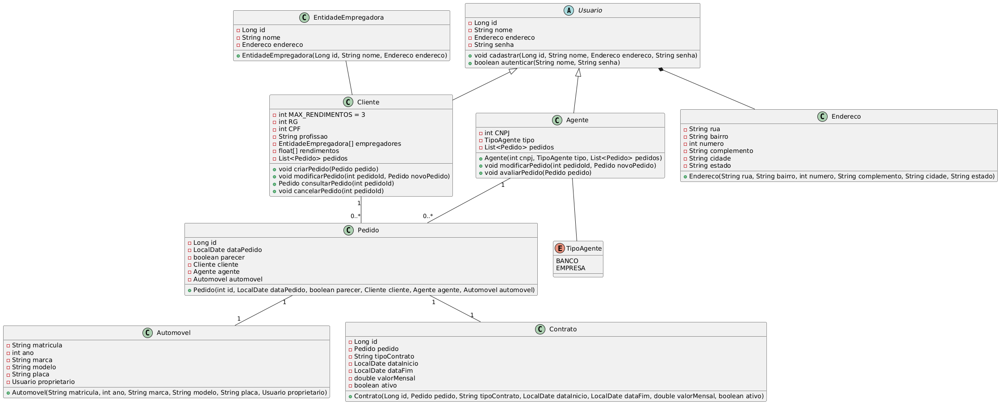
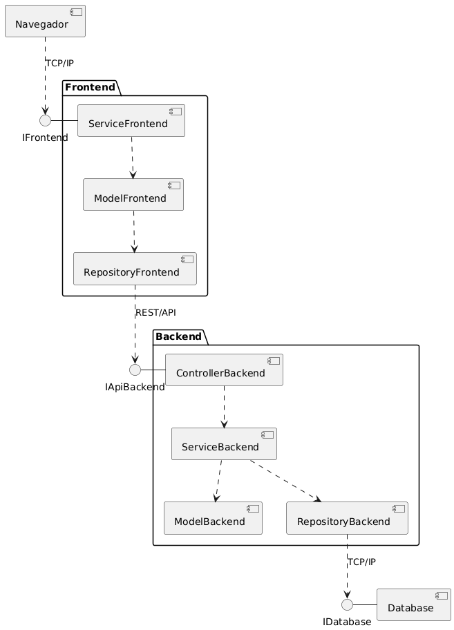

## LabDesenvDeSoftware
Repositório da matéria de Laboratório de Desenvolvimento de Software da do curso de Engenharia de Software da PUC Minas. Acesse:

- [Laboratório 1 - Sistema de Matrículas](https://github.com/juliavianna/LabDesenvDeSoftware/tree/main/laboratorio1)
- [Laboratório 2 - Sistema de Aluguel de Carros](https://github.com/juliavianna/LabDesenvDeSoftware/tree/main/laboratorio2)
- Laboratório 3 (em breve)
- Laboratório 4 (em breve)
- Laboratório 5 (em breve)

A seguir, são apresentados os artefatos do laboratório atual (Laboratório 2).

# Diagrama de caso de uso

# Diagrama de classes

# Diagrama de pacotes

# Diagrama de componentes

# Histórias de Usuário

**Como** usuário,  
**Eu quero** fazer login no sistema,  
**Para que** eu possa acessar minhas informações pessoais e pedidos.  

---

**Como** usuário,  
**Eu quero** me cadastrar no sistema,  
**Para que** eu possa acessar minhas informações pessoais e realizar pedidos.  

---

**Como** cliente,  
**Eu quero** consultar meus pedidos,  
**Para que** eu possa acompanhar seu status e detalhes.  

---

**Como** cliente,  
**Eu quero** cancelar um pedido,  
**Para que** eu possa desistir dele antes da execução do contrato.  

---

**Como** cliente,  
**Eu quero** modificar um pedido,  
**Para que** eu possa ajustar informações antes da execução do contrato.  

---

**Como** cliente,  
**Eu quero** criar um pedido,  
**Para que** eu possa alugar um automóvel.  

---

**Como** agente,  
**Eu quero** avaliar os pedidos criados,  
**Para que** eu possa verificar se atendem aos critérios estabelecidos antes da execução.  

---

**Como** agente,  
**Eu quero** dar um parecer sobre os pedidos,  
**Para que** eu possa aprovar ou rejeitar.  

---
  
**Como** agente,  
**Eu quero** executar o contrato de um pedido aprovado,  
**Para que** eu possa formalizar o aluguel do carro.  

---

**Como** banco,
**Eu quero** poder conceder contrato de crédito
**Para** oferecer financiamento adequado aos clientes e gerar receita com juros.  

